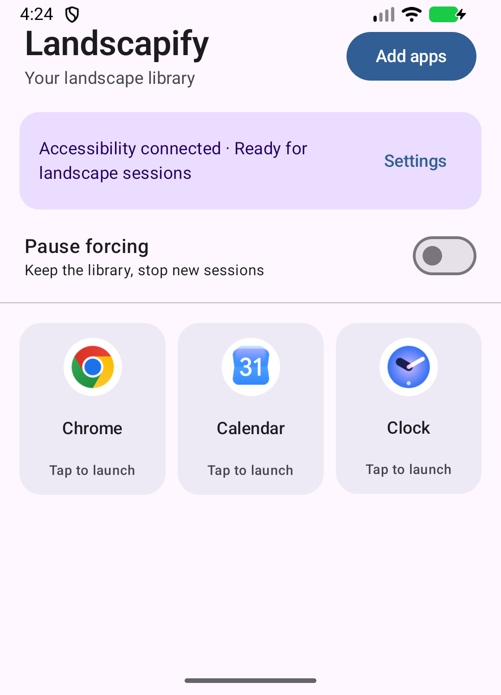

# Landscapify

**Launch the apps you choose in a temporary landscape session.** Add them to your library, tap to open one, and Landscapify releases its orientation window when you leave.

[Download the latest APK](https://github.com/FantoX/Landscapify/releases/latest) · [Get started](#get-started) · [Build from source](#build-from-source)

**Android 11+** · **No Shizuku, root, Wireless debugging, Developer options, or computer** · **No internet permission**

<p align="center">
  
</p>

## Get started

1. Download the **universal APK** from the [latest GitHub Release](https://github.com/FantoX/Landscapify/releases/latest) and install it on an Android 11 or newer device.
2. Open Landscapify, tap **Set up**, and enable its service in Android **Accessibility** settings. Return to the app. If you chose **Later**, use **Set up** on the status card instead.
3. Tap **Add apps**, choose the installed apps you want in your library, and tap **Add**.
4. Tap an app tile to launch it. On the first launch, grant **Usage Access** when prompted, then tap the tile again.

To end a session, leave the selected app for about three seconds or tap **Stop session** in Landscapify's session notification. **Pause forcing** ends the current session and prevents new ones while keeping your library. Long press a tile to remove it.

## How it works

Landscapify starts a session before opening the selected app. Its Accessibility service places a transparent, untouchable window that requests landscape orientation. A foreground service watches app transitions through Usage Access and removes the window after you leave the selected app. Android also removes the window if the Landscapify process dies.

The app does not change system rotation settings or per-app compatibility flags. It does not read screen content, perform gestures, or connect to an external service.

| Access | Why it is needed |
| --- | --- |
| **Accessibility** | Creates the temporary orientation window during a session. |
| **Usage Access** | Detects when you leave the selected app so the session can end. |
| **Foreground service** | Keeps the active session running and provides a **Stop session** action. |

## Device and app compatibility

Android 11 or newer is required, but landscape behavior depends on the device's Android build and the app being launched. Some apps may stay portrait, become letterboxed, or render poorly even when the display rotates. Landscapify marks an app **Unsupported** when its landscape check fails; remove and add that app again to retry after a device or app update.

The current approach was verified on an Android 17 phone emulator with a portrait-locked test app and Wireless debugging off. The display rotated for the session and returned to portrait afterward, including after Landscapify was force-stopped. An Accessibility overlay also rotated an iQOO 9 SE running Android 14, but target-app behavior on that device has not been confirmed with this version. See [the feasibility notes](M0-Feasibility.md) for the test boundary.

## Downloads and updates

The [release page](https://github.com/FantoX/Landscapify/releases/latest) provides these signed APKs and `SHA256SUMS.txt`:

| APK suffix | Choose it for |
| --- | --- |
| `universal` | **Recommended.** Works across the supported CPU architectures, including x86 emulators. |
| `arm64-v8a` | Most modern Android phones and tablets. |
| `armeabi-v7a` | Older 32-bit ARM devices. |
| `x86_64` | 64-bit x86 Android emulators and devices. |

The architecture-specific APKs are only slightly smaller because this app contains little native code. Use `SHA256SUMS.txt` to check a downloaded APK if desired.

**Switching from a debug build?** Release APKs use a different signing key. Android cannot install one over a debug-signed copy. Uninstall the debug copy first, then install the release APK and add your apps again; uninstalling erases the local library. Future release APKs signed with the same key can update an existing release install.

**Updating from v0.2.0?** End any active session before updating. If the older version left a `pending_restore` recovery record, this version will block new sessions because it cannot restore that version's compatibility changes. Restore the old session with a compatible v0.2.0 build before updating again. Keep its app data until recovery is complete; uninstalling erases the recovery record.

## Build from source

Use **JDK 17** and **Android SDK 35**. Open the project in Android Studio, or run Gradle from the repository root:

```powershell
# Windows PowerShell
.\gradlew.bat :app:assembleDebug :app:lintDebug
```

```bash
# macOS / Linux
bash ./gradlew :app:assembleDebug :app:lintDebug
```

The installable universal debug APK is at `app/build/outputs/apk/debug/app-universal-debug.apk`.

## Publishing a GitHub Release

The [release workflow](.github/workflows/release.yml) runs when a `vMAJOR.MINOR.PATCH` tag is pushed. It checks that the tag matches `versionName`, builds and lints signed release APKs, verifies their signing certificate, generates SHA-256 checksums, and uploads all four APKs plus `SHA256SUMS.txt`. The [v0.3.0 release](https://github.com/FantoX/Landscapify/releases/tag/v0.3.0) was published through this workflow.

For the next release, increase `versionCode` and set `versionName` in [app/build.gradle.kts](app/build.gradle.kts), commit and push that change, then push the matching tag:

```bash
git tag v0.3.1
git push origin v0.3.1
```

The workflow uses four repository Actions secrets: `LANDSCAPIFY_SIGNING_KEY_BASE64`, `LANDSCAPIFY_KEYSTORE_PASSWORD`, `LANDSCAPIFY_KEY_ALIAS`, and `LANDSCAPIFY_KEY_PASSWORD`. Keep the keystore and credentials backed up securely outside the repository. Losing the key prevents future APKs from updating existing release installs. The expected release certificate SHA-256 fingerprint is `AC:12:10:55:5C:F7:E1:80:E8:5F:A0:D4:46:3D:8C:B8:DD:30:0D:E4:6A:B6:31:3C:F3:82:83:4C:43:66:9B:56`.
