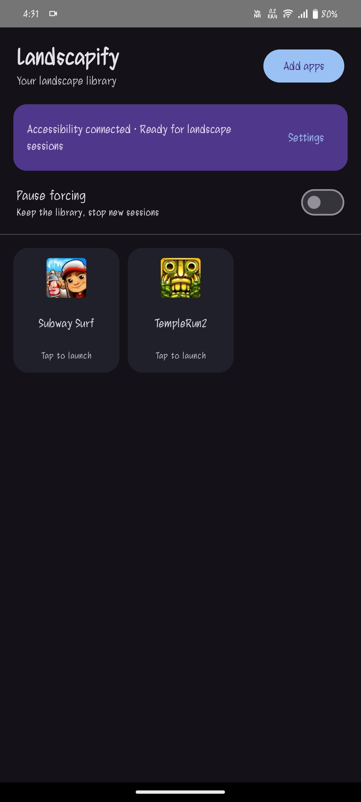

# Landscapify

**Your apps, in landscape, one session at a time.** Build a library of installed apps, tap one to launch it, and Landscapify stops forcing landscape when you leave.

[Download the latest APK](https://github.com/FantoX/Landscapify/releases/latest) · [Get started](#get-started) · [Compatibility](#compatibility) · [Build from source](#build-from-source)

**Android 11+** · **No Shizuku or root** · **No Wireless debugging or Developer options** · **No internet permission**

## See it in action

https://github.com/user-attachments/assets/8469f33f-2db2-42c0-b8cc-f22130e27f3e

*Subway Surfers running in landscape · 16-second demo*

<details>
<summary>See the Landscapify app library</summary>

<p align="center">
  
</p>

</details>

## Get started

1. Download the **universal APK** from the [latest GitHub Release](https://github.com/FantoX/Landscapify/releases/latest) and install it on an Android 11 or newer device. Android may ask you to allow installation from your browser or file manager.
2. Open Landscapify, tap **Set up**, and enable its service in Android **Accessibility** settings. Return to the app. If you chose **Later**, use **Set up** on the status card instead.
3. Tap **Add apps**, choose the installed apps you want in your library, and tap **Add**.
4. Tap an app tile to launch it. On the first launch, grant **Usage Access** when prompted, then tap the tile again.

To end a session, leave the selected app for about three seconds or tap **Stop session** in Landscapify's session notification. **Pause forcing** ends the current session and prevents new ones while keeping your library. Long press a tile to remove it.

## Showcase

https://github.com/user-attachments/assets/8469f33f-2db2-42c0-b8cc-f22130e27f3e

[▶ Watch Subway Surfers in landscape](Showcase/Landscapify_Subway_surfers.mp4) · 16-second MP4 demo

> [!IMPORTANT]
> **Play Protect may warn or block installation.** GitHub APKs are installed outside Google Play, and Landscapify uses Accessibility. Download only from the official release, compare the APK's SHA-256 with `SHA256SUMS.txt`, and let Play Protect scan it if prompted.
>
> If Play Protect labels the app harmful or blocks it, [report the exact warning](https://github.com/FantoX/Landscapify/issues) so it can be investigated. Google recommends keeping Play Protect on. If you choose to turn off **Scan apps with Play Protect** temporarily for a verified APK, turn it back on immediately after installing. See [Google's warning guidance](https://developers.google.com/android/play-protect/warning-dev-guidance) and [Play Protect settings](https://support.google.com/googleplay/answer/2812853?hl=en).

## How it works

Landscapify starts a session before opening the selected app. Its Accessibility service places a transparent, untouchable window that requests landscape orientation. A foreground service watches app transitions through Usage Access and removes the window after you leave the selected app. Android also removes the window if the Landscapify process dies.

The app does not change system rotation settings or per-app compatibility flags. It does not read screen content, perform gestures, or connect to an external service.

| Access                 | Why it is needed                                                         |
| ---------------------- | ------------------------------------------------------------------------ |
| **Accessibility**      | Creates the temporary orientation window during a session.               |
| **Usage Access**       | Detects when you leave the selected app so the session can end.          |
| **Foreground service** | Keeps the active session running and provides a **Stop session** action. |

## Compatibility

Android 11 or newer is required, but landscape behavior depends on the device's Android build and the app being launched. Some apps may stay portrait, become letterboxed, or render poorly even when the display rotates. Landscapify marks an app **Unsupported** when its landscape check fails; remove and add that app again to retry after a device or app update.

| Tested environment | Result |
| --- | --- |
| Android 17 phone emulator | A portrait-locked test app rotated with Wireless debugging off. The display returned to portrait after leaving the app and after force-stopping Landscapify. |
| iQOO 9 SE, Android 14 | The Accessibility overlay rotated the display. Target-app behavior on this device has not yet been confirmed with this version. |

See [the feasibility notes](M0-Feasibility.md) for the full test boundary. The demo above shows one app working in landscape; it does not guarantee the same result for every app or phone.

## Downloads and updates

The [release page](https://github.com/FantoX/Landscapify/releases/latest) provides these signed APKs and `SHA256SUMS.txt`:

| APK suffix    | Choose it for                                                                           |
| ------------- | --------------------------------------------------------------------------------------- |
| `universal`   | **Recommended.** Works across the supported CPU architectures, including x86 emulators. |
| `arm64-v8a`   | Most modern Android phones and tablets.                                                 |
| `armeabi-v7a` | Older 32-bit ARM devices.                                                               |
| `x86_64`      | 64-bit x86 Android emulators and devices.                                               |

The architecture-specific APKs are only slightly smaller because this app contains little native code. Use `SHA256SUMS.txt` to check a downloaded APK if desired.

**Switching from a debug build?** Release APKs use a different signing key. Android cannot install one over a debug-signed copy. Uninstall the debug copy first, then install the release APK and add your apps again; uninstalling erases the local library. Future release APKs signed with the same key can update an existing release install.

**Updating from v0.2.0?** End any active session before updating. If the older version left a `pending_restore` recovery record, this version will block new sessions because it cannot restore that version's compatibility changes. Restore the old session with a compatible v0.2.0 build before updating again. Keep its app data until recovery is complete; uninstalling erases the recovery record.

## Build from source

Use **JDK 17** and **Android SDK 35**. Open the project in Android Studio, or run Gradle from the repository root:

```powershell
# Windows PowerShell
.\gradlew.bat :app:assembleDebug :app:lintDebug
```

```bash
# macOS / Linux
bash ./gradlew :app:assembleDebug :app:lintDebug
```

The installable universal debug APK is at `app/build/outputs/apk/debug/app-universal-debug.apk`.

## Contributing

Contributions are welcome. If an app behaves differently on your device, please [open an issue](https://github.com/FantoX/Landscapify/issues) with your device model, Android version, app name, and what happened. For code or documentation changes, open a pull request and include how you tested it. Focused reports and fixes help improve compatibility across devices.

## Thank you

Thank you for trying Landscapify and helping make it better for other Android users.
